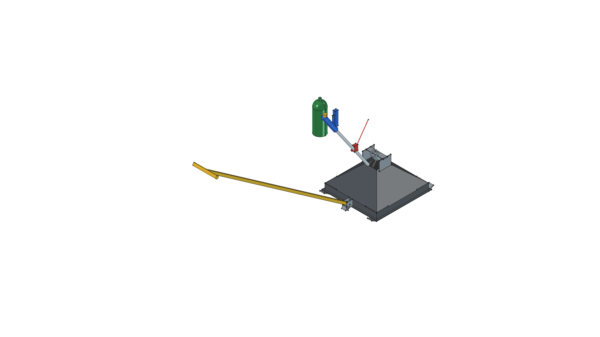

# Road Roaster

> *Towable Thermal Weed Shock Sled*

---

## Active Master Release: Version 04

| Master Render Snapshot | Active Version Details & Master Links |
| :---: | :--- |
|  | • **Latest Optimal Version**: **[Version 04](v04/)**<br>• **Master CAD Model**: [`flame_sled.FCStd`](flame_sled.FCStd) (Master copy of v04)<br>• **Torch Unit**: [Harbor Freight Propane Torch #91037](../../components/torch_hf91037/)<br>• 📋 [**REQUIREMENTS.md**](REQUIREMENTS.md)<br>• 📐 [**v04/SPECIFICATION.md**](v04/SPECIFICATION.md)<br>• ✂️ [**v04/CUT_LIST.md**](v04/CUT_LIST.md)<br>• 🛠️ [**v04/FABRICATION_GUIDE.md**](v04/FABRICATION_GUIDE.md)<br>• 📦 [**v04/BOM.md**](v04/BOM.md)<br>• 🚀 [**v04/README.md**](v04/README.md) *(Full 7-View Gallery)* |

---

## Project Overview

The **Road Roaster** is a heavy-duty, heat-concentrating drag hood pulled ahead of an operator via a 5 ft rigid steel tow bar. Engineered for chemical-free gravel driveway and pathway weed management via thermal shock (150°F–180°F), it mounts a high-output **Harbor Freight #91037 Propane Torch** above an enclosed 14-gauge mild steel pyramidal hood to burst weed cell walls at walking speed while keeping heat safely directed away from the operator.

---

## Evolutionary Version History & Human-AI Design Journey

This project documents the collaborative evolutionary cycle between human shop feedback and AI-agentic parametric CAD modeling across 4 version iterations:

| Version | Directory | Design Milestones & Key Evolutionary Changes | Status |
| :---: | :--- | :--- | :---: |
| **v04** | [`v04/`](v04/) | **Master Version**: Organized 3D model into 4 modular FreeCAD `App::DocumentObjectGroup` containers (`Flame_Sled_Pyramid_Hood`, `Overhead_Support_Frame`, `Rigid_Towbar_Hitch`, `Harbor_Freight_Torch_91037`), establishing clean tree structure and parametric VarSet (`dims`) control. | **OPTIMAL MASTER** |
| **v03** | [`v03/`](v03/) | **Ergonomic Forward Lean**: Re-angled torch handle wand 180° forward leaning toward the operator pulling at the front, putting the blue handle, flow knob, and piezo igniter within comfortable walking reach. | Ergonomic Refinement |
| **v02** | [`v02/`](v02/) | **Mechanical Integration**: Integrated overhead steel bridge mounting frame, Harbor Freight #91037 propane torch module, 2.0" vertical skirts, and 5 ft rigid square tube tow bar with 20° drop-stop rest tab. | Mechanical Integration |
| **v01** | [`v01/`](v01/) | **Baseline Prototype**: Initial $18'' \times 18''$ closed pyramid hood geometry, 14-gauge sheet metal templates, and dual $1.5'' \times 3/16''$ flat bar skid runners with 30° turned-up tips. | Baseline |

---

## FreeCAD Execution Command

To build the active master model (Version 04) and generate all 7 orthographic view renders:

```bash
/home/phi/AppImages/FreeCAD_1.1.3-Linux-x86_64-py311.AppImage -c "__file__='/home/phi/PROJECTS/phi-WORKS/maker/projects/road-roaster/v04/build.py'; exec(open(__file__).read())"
```
