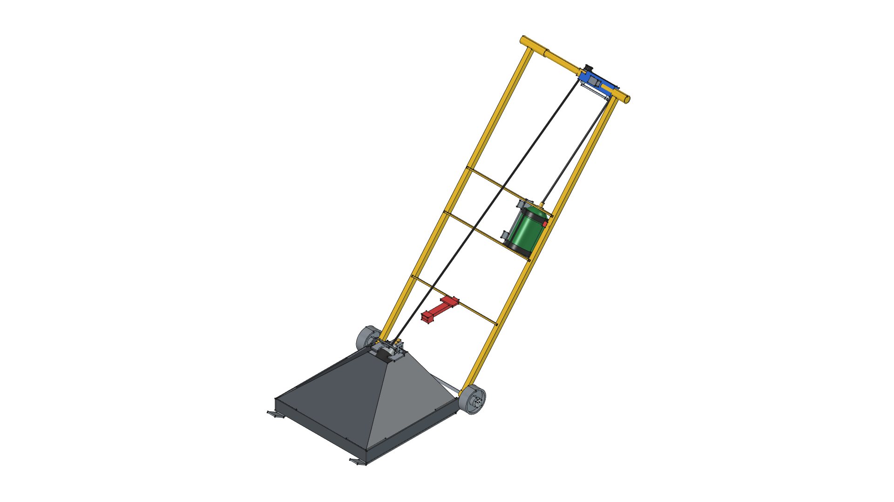

# Road Roaster

> **Directional Ceramic Infrared Thermal Weed Shock Sled**  
> *Chemical-Free, Energy-Efficient Hardscape Weed Eradication via Concentrated Radiant Heat*

**Active CAD Model**: [`road-roaster.FCStd`](road-roaster.FCStd)  
**Status**: 🟡 **`[IN PROGRESS - v0.7.0]`**  
**Engineering Collaboration Document**: [**`SOLARONICS_INQUIRY.md`**](SOLARONICS_INQUIRY.md) *(OEM Technical Outreach & Application Proposal)*  


---

## 1. The Problem: Hardscape Weed Invasions & The Chemical Trap

Gravel driveways, roadside corridors, cobblestone pathways, paver patios, and agricultural headlands are chronically invaded by resilient, deep-rooted weeds (dandelions, thistles, crabgrass, bindweed, and woody invasives). Managing these unwanted plants presents major challenges:

* **The Failure of Mechanical Weeding**: Hand-pulling is back-breaking, time-consuming, and leaves deep taproots intact to regrow within days. String trimmers fling hazardous gravel projectiles, damage surrounding structures, and only sever top growth without damaging root crowns.
* **The Environmental & Health Hazards of Chemical Herbicides**: Synthetic chemical herbicides (glyphosate, 2,4-D, diquat) cause toxic runoff into groundwater, harm children, pets, and pollinators, and generate chemical-resistant weeds.
* **The Aerodynamic Blast Hazard of Open Torches**: Conventional weed torches produce violent high-velocity gas jets that blow gravel, dust, and sparks out into the operator's path.

---

## 2. The Solution: High-Intensity Ceramic Infrared Radiant Shock

The **Road Roaster** utilizes **Solaronics high-intensity gas-fired ceramic infrared technology** mounted to a restored **vintage commercial hand truck chassis** with common-wheel-axis triangular suspension:

```
┌────────────────────────────────────────────────────────────────────────────────────────┐
│                        THE CERAMIC INFRARED WEED SHOCK ENGINE                          │
│                                                                                        │
│     • Cordierite Grooved Ceramic Plaque Matrix: 1,800°F Cherry-Red Glowing Surface     │
│     • Direct Infrared Radiant Flux (3–5 µm): Direct absorption into plant water cells │
│     • Zero Blast Pressure: Flameless micro-pore combustion (no blown gravel or dust)   │
│     • Deep Parabolic Aluminum Reflector: Directs >90% of radiant flux straight down    │
│     • Inconel Re-Radiating Wire Grid: Emissivity booster and stone guard shield        │
│     • Common-Wheel-Axle Suspension: Concentric triangular pivot on 9.5" wheel axle     │
│     • Center-Support Flexible Hose: 3D B-spline reinforced LP hose down center spine   │
└────────────────────────────────────────────────────────────────────────────────────────┘
```

### The Science of Thermal Weed Eradication
Thermal weed control does **not** require burning green vegetation to ash. Heating plant leaves to **$140^\circ\text{F} – 180^\circ\text{F}$ ($60^\circ\text{C} – 82^\circ\text{C}$)** for **1 to 2 seconds** instantaneously boils cellular sap, rupturing plant cell membranes and causing the entire weed structure and root crown to desiccate and die within 24 to 48 hours.

---

## 3. Technology Comparison: Open Torches vs. Solaronics Radiant Sled

| Feature | Conventional Open Torch Wand | Road Roaster Solaronics Radiant Sled |
| :--- | :--- | :--- |
| **Combustion Type** | High-velocity turbulent open-air jet | Flameless micro-pore surface combustion |
| **Aerodynamic Blast** | Severe positive air jet; blows gravel & sparks | **Zero dynamic blast pressure** (whisper quiet) |
| **Energy Delivery** | Convective hot gas (85%+ lost to wind) | **Direct Electromagnetic Radiant Flux** (3–5 $\mu\text{m}$) |
| **Thermal Power Needed** | 300,000 – 500,000 BTU/hr (gross waste) | **60,000 BTU/hr** (concentrated cellular shock) |
| **1 lb Propane Runtime** | ~4 to 8 minutes | **35 to 50 minutes** |
| **Chassis & Maneuverability** | Handheld cantilevered wand | **Vintage Restored Hand Truck Base** with 9.5" wheels |
| **Suspension Mechanism** | None (cantilevered in air) | **Common-Wheel-Axle Triangular Sled Straps** |
| **Gas Routing** | Rigid pipe along wand | **Center-Support Routed Flexible B-Spline LP Hose** |
| **Deep Heat-Soak Mode** | Cannot dwell over spots without fire hazard | **15–30s Dwell** conducts $180^\circ\text{F}$ 1–2" into soil to kill taproots |

---

## 4. Dual Operational Modes

```
               [ TRANSIT / LATCHED MODE ]                                  [ GLIDE ROASTING / FREE MODE ]
           (Tilt back to roll across grass/asphalt)                     (Glides flat on ground for weed shock)

                     /                                                           /
                    /                                                           /
                   /  [Snap Latch ENGAGED]                                     /  [Snap Latch RELEASED]
                  /                                                           /
   (Skids 4" UP) /                                                           /
    ▲           /                                                           /
    │      [HAND TRUCK]                                                [HAND TRUCK]
    │          │                                                           │
   (O)=========┴──────(Sled Lifted)                                       (O)─────────[Sled Gliding on Ground]
```

1. **Gliding Roasting Mode**: The sled rests flat on dual $1.5'' \times 3/16''$ flat bar skid runners with $30^\circ$ ski tips, maintaining a steady $2.0''$ radiant emitter clearance while walking at $1 - 2\text{ mph}$.
2. **Rolling Transit Mode**: Stepping on the foot-release latch engages the upright catch; tilting the hand truck back lifts the entire sled $4.0''$ off the ground for rolling over turf, curbs, and pavement on $10.0''$ heavy-duty wheels.

---

## 5. Visual Transformation & Milestone History

| Version | Status | Milestone Description | Thumbnail Preview |
| :--- | :--- | :--- | :--- |
| **v0.7.0** | 🟡 `[IN PROGRESS]` | Solaronics Ceramic Infrared Array & Commercial Hand Truck Frame |  |
| **v0.6.0** | 📦 `[SUPERSEDED]` | Decomposed Torch Controls & Forward-Firing Asymmetrical Hood |  |
| **v0.5.0** | 📦 `[SUPERSEDED]` | Upright-Vacuum Tilt-Back Frame & Dual Metal Wheels |  |
| **v0.4.0** | 📦 `[SUPERSEDED]` | Onboard Propane Harness & Imported Components |  |
| **v0.3.0** | 📦 `[SUPERSEDED]` | Modular Subassembly Containers & Parametric VarSet |  |
| **v0.2.0** | 📦 `[SUPERSEDED]` | Ergonomic Forward Lean Torch Integration |  |
| **v0.1.0** | 📦 `[SUPERSEDED]` | Mechanical Sled Integration & Tow Bar |  |
| **v0.0.0** | 📦 `[SUPERSEDED]` | Baseline Sled Skid & Pyramid Hood Prototype |  |

---

## 6. Build Instructions

To generate the 3D parametric CAD assembly and update all 7 orthogonal/isometric views:

```bash
/home/phi/AppImages/FreeCAD_1.1.3-Linux-x86_64-py311.AppImage -c "__file__='projects/road-roaster/build.py'; exec(open(__file__).read())"
```
