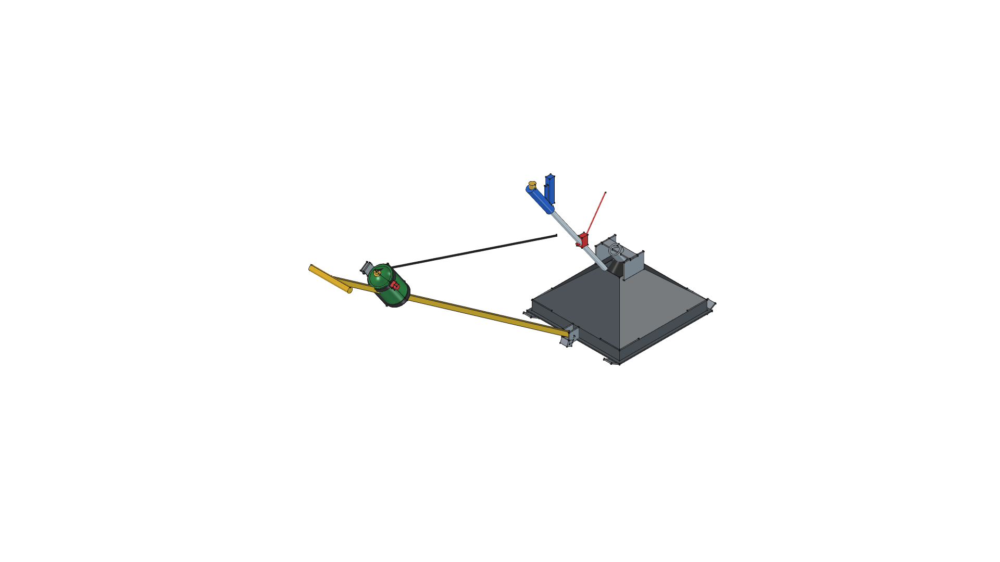
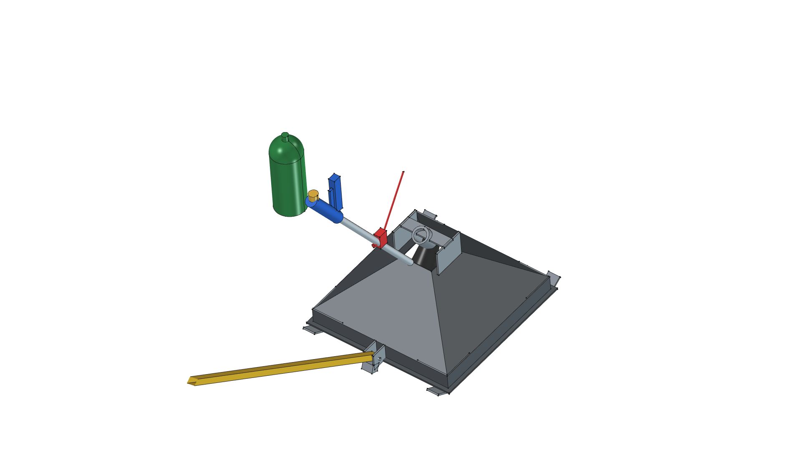

# Road Roaster

> *Towable Thermal Weed Shock Sled*

---

## Utility & Overview

The **Road Roaster** is a heavy-duty, heat-concentrating drag hood pulled ahead of an operator via a 5 ft rigid steel tow bar. Engineered for chemical-free gravel driveway and pathway weed management via thermal shock (150°F–180°F), it mounts a high-output **[Harbor Freight #91037 Propane Torch](../../components/torch_hf91037/)** above an enclosed 14-gauge mild steel pyramidal hood to burst weed cell walls at walking speed while keeping heat safely directed away from the operator.

---

## Evolutionary Version History & Human-AI Design Journey

This project documents the collaborative evolutionary cycle between human shop feedback and AI-agentic parametric CAD modeling across version iterations following **Semantic Versioning** (newest release at the top):

| Version | Representative CAD Snapshot | Design Milestones & Key Evolutionary Changes | Lifecycle Status |
| :---: | :---: | :--- | :---: |
| **[v1.4.0](v1.4.0/)**<br>*(v1.4.0 Master)* |  | **Onboard Propane Harness & Imported Components**: Integrated standalone 1 lb Propane Cylinder (`components/propane_cylinder_1lb/`) and quick-slip Propane Bottle Harness (`components/propane_harness/`) onto upper tow bar handle tube. Refactored `v1.4.0/build.py` into dedicated subassembly functions (`build_*_subassembly()`) importing standalone external component modules.<br><br>📋 [**REQUIREMENTS.md**](v1.4.0/REQUIREMENTS.md) • 📐 [**SPECIFICATION.md**](v1.4.0/SPECIFICATION.md) • ✂️ [**CUT_LIST.md**](v1.4.0/CUT_LIST.md) • 🛠️ [**FABRICATION_GUIDE.md**](v1.4.0/FABRICATION_GUIDE.md) • 📦 [**BOM.md**](v1.4.0/BOM.md) • 🛠️ [**build.py**](v1.4.0/build.py) | 🟡 **`[IN PROGRESS]`** |
| **[v1.3.0](v1.3.0/)**<br>*(v1.3.0)* |  | **Modular Master Container**: Organized 3D model into 4 modular FreeCAD `App::DocumentObjectGroup` containers (`Flame_Sled_Pyramid_Hood`, `Overhead_Support_Frame`, `Rigid_Towbar_Hitch`, `Harbor_Freight_Torch_91037`), establishing clean tree structure and parametric VarSet (`dims`) control.<br><br>📋 [**REQUIREMENTS.md**](v1.3.0/REQUIREMENTS.md) • 📐 [**SPECIFICATION.md**](v1.3.0/SPECIFICATION.md) • ✂️ [**CUT_LIST.md**](v1.3.0/CUT_LIST.md) • 🛠️ [**FABRICATION_GUIDE.md**](v1.3.0/FABRICATION_GUIDE.md) • 📦 [**BOM.md**](v1.3.0/BOM.md) • 🛠️ [**build.py**](v1.3.0/build.py) | 📦 **`[SUPERSEDED]`** |
| **[v1.2.0](v1.2.0/)**<br>*(v1.2.0)* |  | **Ergonomic Forward Lean**: Re-angled torch handle wand 180° forward leaning toward the operator pulling at the front, putting the blue handle, flow knob, and piezo igniter button within comfortable walking reach.<br><br>🛠️ [**build.py**](v1.2.0/build.py) | 📦 **`[SUPERSEDED]`** |
| **[v1.1.0](v1.1.0/)**<br>*(v1.1.0)* |  | **Mechanical Integration**: Integrated overhead steel bridge mounting frame, Harbor Freight #91037 propane torch module, 2.0" vertical skirts, and 5 ft rigid square tube tow bar with 20° drop-stop rest tab.<br><br>🛠️ [**build.py**](v1.1.0/build.py) | 📦 **`[SUPERSEDED]`** |
| **[v1.0.0](v1.0.0/)**<br>*(v1.0.0)* |  | **Baseline Prototype**: Initial $18'' \times 18''$ closed pyramid hood geometry, 14-gauge sheet metal templates, and dual $1.5'' \times 3/16''$ flat bar skid runners with 30° turned-up tips.<br><br>🛠️ [**build.py**](v1.0.0/build.py) | 📦 **`[SUPERSEDED]`** |

---

## FreeCAD Execution Command

To build the active master model (v1.4.0) and generate all orthographic view renders:

```bash
/home/phi/AppImages/FreeCAD_1.1.3-Linux-x86_64-py311.AppImage -c "__file__='/home/phi/PROJECTS/phi-WORKS/maker/projects/road-roaster/v1.4.0/build.py'; exec(open(__file__).read())"
```
