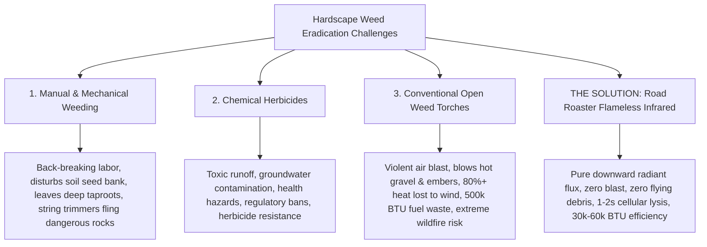

# Road Roaster Platform Suite

> **Directional Flameless Ceramic Infrared Thermal Weed Eradication System**  
> *Chemical-Free, Zero-Blast, Energy-Efficient Hardscape Weed Management via Concentrated Radiant Heat*

---

## Executive Overview & Mission

The **Road Roaster Platform Suite** represents a next-generation approach to non-chemical vegetation control on gravel driveways, roadways, paver patios, cobblestone walkways, and agricultural headlands. 

By replacing high-velocity open-flame weed blowtorches and toxic synthetic herbicides with **flameless downward ceramic infrared radiant energy**, the Road Roaster delivers rapid, lethal cellular shock to invasive weeds with zero aerodynamic blast, zero flying gravel, whisper-quiet operation, and industry-leading fuel efficiency.

```
┌────────────────────────────────────────────────────────────────────────────────────────┐
│                        THE "OVERHEAD GROUND BROILER" PARADIGM                          │
│                                                                                        │
│     Unlike an outdoor grill (which fires upward from below), a commercial steak        │
│     broiler positions its intense heat source ABOVE the target, showering downward     │
│     1,800°F pure infrared radiation.                                                   │
│                                                                                        │
│     The Road Roaster applies this exact principle to hardscape weed control:           │
│     gliding high-intensity cordierite ceramic plaques just inches above the ground     │
│     to direct 3–5 µm electromagnetic radiant flux straight down into plant tissue.     │
│     ZERO open flame. ZERO flying gravel. ZERO wind blowout. Instant cellular lysis.    │
└────────────────────────────────────────────────────────────────────────────────────────┘
```

The platform encompasses **two distinct physical prototype configurations** engineered for different operational scales:

1. **[Road Roaster 2W (Small / Compact Hand Truck Model)](road-roaster-2w/)**: An ultra-compact, highly agile 2-wheel sled built upon a restored vintage tubular steel hand truck, engineered for residential gravel borders, garden walkways, steep terraces, and narrow gates.
2. **[Road Roaster 4W (Large / Commercial Platform Cart Model)](road-roaster-4w/)**: A heavy-duty 4-wheel commercial flatbed dolly carrying a Solaronics K-30 infrared engine, a 20 lb propane cylinder (~14.4 hours runtime), a 2.5-gallon pressurized water safety reservoir, and 180° flip-back transit stowage for large-scale driveways, roadways, and municipal corridors.

---

## 1. The Hardscape Weed Problem & Why Traditional Methods Fail

Maintaining gravel driveways, roadways, paver plazas, and agricultural perimeters free of unwanted vegetation (dandelions, thistles, crabgrass, field bindweed, and woody invasives) is a persistent, expensive challenge. Property owners and municipal crews are trapped between three flawed, hazardous traditional methods:



### The Failure of Mechanical & Manual Weeding
- **Back-Breaking Labor & Incomplete Root Removal**: Hand-pulling is physically punishing and rarely extracts deep, branched taproots (e.g., dandelions, burdock, bindweed), leaving root crowns intact to regenerate within days.
- **Seed Bank Disturbance**: Scraping or tilling gravel disturbs dormant weed seeds beneath the surface, exposing them to light and triggering explosive new germination cycles.
- **Projectile Hazards with String Trimmers**: Using nylon line trimmers along gravel borders turns stones into high-velocity projectiles that break vehicle windows, chip exterior paint, and damage building siding, all while only shredding top growth.

### The Failure & Hazards of Chemical Herbicides
- **Environmental & Groundwater Contamination**: Synthetic herbicides (glyphosate, 2,4-D, diquat) wash off impermeable hardscapes and porous gravel during rainfall, contaminating local storm drains, retention ponds, and groundwater tables.
- **Health Risks to Humans, Pets, & Pollinators**: Increasing public awareness and medical findings have linked chemical herbicide exposure to long-term health risks, leading property owners to seek chemical-free properties safe for children and pets.
- **Regulatory Restrictions & Municipal Bans**: An accelerating number of municipalities, school districts, public parks, and agricultural zones have instituted outright bans or strict moratoriums on synthetic chemical spraying.
- **Superweed Resistance**: Chronic herbicide application accelerates the natural selection of herbicide-resistant weed varieties, requiring increasingly toxic chemical cocktails to achieve diminishing control.

### The Severe Deficiencies of Conventional Open-Flame Weed Torches
- **Violent Aerodynamic Blast Pressure**: Commercial weed torches (e.g., 300,000–500,000 BTU/hr propane wands) produce high-velocity turbulent jet flames. When pointed near the ground or enclosed under a simple steel cowl, the positive pressure jet acts as a pneumatic blower, flinging burning gravel, dry mulch, dust, and sparks into the air.
- **Gross Energy Inefficiency (>80% Convective Heat Loss)**: Open-flame torches rely on convective hot gases. Ambient crosswinds immediately sweep the rising hot air away before it can heat the plant, requiring operators to crank regulators to extreme fuel consumption levels.
- **Severe Wildfire Hazard**: Open torches present extreme fire hazards along dry roadsides, wooden fences, and perimeter vegetation, limiting their use in arid or summer conditions.

---

## 2. The Solution: Flameless Ceramic Infrared Radiant Shock

### The Biophysics of Plant Cell Lysis
A common misconception in thermal weed control is that weeds must be burned to ash or charred black. **Incinerating plant matter is counterproductive, slow, and fuel-wasteful.**

```
┌────────────────────────────────────────────────────────────────────────────────────────┐
│                             THE BIOPHYSICS OF CELL LYSIS                               │
│                                                                                        │
│     1. Radiant Absorption: 3–5 µm infrared wavelengths match water absorption bands.   │
│     2. Rapid Thermal Surge: Target plant leaf heated to 140°F–180°F (60°C–80°C).       │
│     3. Instant Sap Vaporization: Cellular sap expands explosively in 1–2 seconds.     │
│     4. Cell Membrane Rupture: Cell walls burst; photosynthetic proteins coagulate.     │
│     5. Vascular Collapse & Desiccation: Plant completely withers and dies in 24–48h.  │
└────────────────────────────────────────────────────────────────────────────────────────┘
```

When plant leaves are subjected to intense radiant heat raising tissue temperatures to **$140^\circ\text{F} - 180^\circ\text{F}$ ($60^\circ\text{C} - 82^\circ\text{C}$)** for **just 1 to 2 seconds**, the water inside the plant's cells expands rapidly. This internal vapor pressure ruptures cell membranes, coagulates enzymes, and terminates nutrient circulation. Within hours, the weed wilts; within 24 to 48 hours, the plant completely dries up down to the root crown.

### Cordierite Ceramic Infrared Plaque Technology
The core thermal engine of the Road Roaster is a **gas-fired high-intensity ceramic infrared plaque**:
- **Micro-Pore Surface Combustion**: Clean LP gas and primary air mix in an internal plenum and pass through thousands of microscopic perforations in a cordierite ceramic tile matrix, combusting uniformly on the outer surface with no roaring jet flame.
- **1,800°F Radiant Emitter**: The ceramic face glows cherry-red ($1,800^\circ\text{F} / 980^\circ\text{C}$), generating long-wave infrared radiation ($3\text{ to }5\ \mu\text{m}$) precisely matched to the peak absorption spectrum of water.
- **Zero Aerodynamic Blast**: Because fuel combustion occurs within the ceramic pores, there is **zero positive dynamic blast pressure**. The burner operates with a whisper-quiet hiss, leaving gravel, dust, and embers completely undisturbed.
- **Down-Firing Parabolic Reflector**: A mirror-finish reflector hood directs greater than 90% of all generated radiant energy downward onto the roadbed, shielding the heat from crosswinds.
- **Deep Taproot Dwell Capability**: Because there is no open flame to cause combustion, the sled can safely dwell over a stubborn taproot for 15 to 30 seconds, conducting lethal heat $1''\text{ to }2''$ into the topsoil to destroy root crowns without starting fires.

---

## 3. The Business Case & Prototyping Economics

```
┌────────────────────────────────────────────────────────────────────────────────────────┐
│                              THE ROAD ROASTER VALUE PROPOSITION                        │
├─────────────────────────┬───────────────────────────────┬──────────────────────────────┤
│ 1. Operating Economics  │ 2. Safety & Compliance        │ 3. Ergonomics & Productivity │
│   • $0.00 chemical cost │   • Zero chemical runoff      │   • Upright walking posture  │
│   • 85% fuel reduction  │   • Zero gravel projectile    │   • Zero back strain         │
│   • 14+ hr tank runtime │   • Safe for kids, pets & eco │   • Up to 2 mph coverage     │
└─────────────────────────┴───────────────────────────────┴──────────────────────────────┘
```

### 1. Operating Return on Investment (ROI)
- **Zero Herbicide Expenditure**: Commercial landscape and agricultural operations spend hundreds to thousands of dollars annually on chemical concentrates, surfactant adjuvants, spray tanks, personal protective equipment (PPE), and hazardous disposal fees. Road Roaster eliminates recurring chemical costs entirely.
- **85% Fuel Savings vs. Open Torches**: Conventional torches burn 300,000 to 500,000 BTU/hr to overcome wind loss. The Road Roaster achieves superior lethal cellular shock using only **30,000 to 60,000 BTU/hr**, stretching a standard 20 lb propane cylinder from 1.5 hours of open torching to **over 14 continuous hours** of operation.

### 2. Commercial & Municipal Market Demand
- **Organic Agriculture & Vineyards**: Certified organic growers cannot use synthetic herbicides in orchard rows, vineyard alleys, and headlands. Flameless infrared weeding preserves organic certification while eliminating hand-weeding crews.
- **Municipal Public Works, Parks, & Schools**: Cities and school boards facing public health mandates against pesticide use require clean, non-toxic alternatives for maintenance of walking trails, gravel parking areas, sports field borders, and roadside gutters.
- **Estate & HOA Property Maintenance**: Large residential estates and communities with private roads, paver patios, and extensive gravel driveways require clean curb appeal without exposing residents, pets, or nearby waterways to toxic sprays.

### 3. Ergonomics, Labor Productivity, & Speed
- Upright walk-behind operation eliminates kneeling, crawling, and bending.
- At an operational walking speed of $1\text{ to }2\text{ mph}$, an operator can treat thousands of linear feet of driveway edge or path per hour with minimal physical fatigue.

---

## 4. The Two Prototype Models: Small vs. Large

To serve distinct operational needs, we have engineered two complementary prototype architectures:

```
                  ROAD ROASTER PLATFORM SUITE
                               │
               ┌───────────────┴───────────────┐
               ▼                               ▼
       ROAD ROASTER 2W                 ROAD ROASTER 4W
     (Compact Hand Truck)          (Commercial Platform Cart)
               │                               │
    • Agility in tight paths        • Massive 14.4 hr runtime
    • Vintage 2-wheel chassis       • Heavy-duty 24"x36" flatbed
    • Common-axis pivot sled        • 180° flip-back cantilever
    • 1 lb quick-change bottle      • 20 lb DOT LP gas cylinder
    • 15" x 18" hover footprint     • 2.5 gal water safety tank
    • 35–50 min continuous run      • Auxiliary spot torch wand
```

---

### Model 1: Road Roaster 2W (Small / Compact Hand Truck Model)
*The High-Agility, Garden-Path & Narrow-Access Specialist*

* **Chassis Foundation**: Restored vintage tubular steel commercial hand truck with heavy-gauge $1.0''\text{ OD}$ red tubing, triangular axle trusses, and $9.5'' \times 3.0''$ semi-pneumatic wheels on a $5/8''$ continuous axle.
* **Thermal Engine**: Directional Solaronics ceramic infrared radiant burner housed within a formed 14-gauge steel sled cowl ($15.0''\text{ W} \times 18.0''\text{ L}$) with dual $1.5'' \times 3/16''$ flat bar ground skid runners with $30^\circ$ ski tips.
* **Key Innovation — Common-Wheel-Axle Triangular Suspension**: The radiant sled pivots concentrically around the main wheel axle via triangulated suspension straps, decoupling chassis tilt from burner ground hover.
* **Dual Operational Modes**:
  1. *Gliding Roast Mode*: Sled glides smoothly over gravel on skids at a locked $2.0''$ ground clearance.
  2. *Rolling Transit Mode*: Stepping on the rear foot latch hooks the upright catch; tilting back lifts the sled $4.0''$ off the ground for fast rolling over curbs and lawns.
* **Fuel & Portability**: Lightweight 1 lb (16.4 oz) LP cylinder mounted in a quick-release retention cage on the center spine; easily hot-swapped in seconds or connected via optional backpack hose.
* **Target Applications**: Narrow garden paths, gravel walkways, cobblestone borders, raised terraces, gated residential properties, and tight obstacles.
* **Status**: 🟡 **`[v0.7.0 IN PROGRESS]`** — Fully modeled in CAD with parametric VarSet, fabrication cut lists, and mass property validation.
* 📖 [**Explore Road Roaster 2W Subproject**](road-roaster-2w/README.md)

---

### Model 2: Road Roaster 4W (Large / Commercial Platform Cart Model)
*The Commercial Driveway, Roadway, & Agricultural Headland Workhorse*

* **Chassis Foundation**: Commercial 24" × 36" (610 mm × 914 mm) diamond-plate steel platform truck ($1,000+\text{ lb}$ payload capacity) with 5" industrial caster running gear (2 front fixed, 2 rear 360° swivel with foot brakes) and a rigid 29" push handle with dual cross rails.
* **Thermal Engine**: 30,000 BTU Solaronics K-30 ceramic infrared radiant engine ($1,800^\circ\text{F}$ downward emitter, 173 sq. in radiating matrix) housed in a flared mirror reflector cowl with 45° miter relief corners.
* **Key Innovation — 180° Flip-Back Cantilever Stowage**: 
  - Front-mounted 3/16" formed steel apron carries dual arched ear brackets and a continuous 3/4" cold-rolled steel pivot axle.
  - In *Operating Mode*, the burner cantilevers forward, hovering stably 1.5" above the roadbed with front drop arms resting on rigid anvil pads.
  - In *Transit / Stowage Mode*, the burner flips 180° back over the axle to rest flat on the front cart deck, centering mass over the 4-wheel wheelbase for effortless transport and compact storage.
* **Massive Fuel & Water Payload**:
  - Full **20 lb DOT LP gas cylinder** (430,960 BTU capacity) providing **~14.4 continuous operating hours**.
  - Onboard **2.5-gallon pressurized water washdown tank** with brass pump and coiled spray wand for immediate pavement quenching and perimeter fire prevention.
* **Auxiliary Spot Torch Integration**: Quick-draw holster on the rear push handle carries an auxiliary propane wand (`torch_hf91037`) for spot-treating fence posts, curbs, and tight vertical obstructions.
* **Target Applications**: Commercial driveways, roadway shoulders, parking lot expansion joints, municipal pathways, paver plazas, and vineyard/orchard headlands.
* **Status**: 🟢 **`[v0.2.0 RELEASED]`** — Fully modular linked CAD assembly with FreeCAD 1.1 kinematic joints, VarSet skeleton, and programmatic exploded views.
* 📖 [**Explore Road Roaster 4W Subproject**](road-roaster-4w/README.md)

---

## 5. Side-by-Side Model Comparison

| Specification | Road Roaster 2W (Small Model) | Road Roaster 4W (Large Model) |
| :--- | :--- | :--- |
| **Primary Focus** | Residential agility, narrow paths, slopes | Commercial driveways, roadways, headlands |
| **Active Version** | [**v0.7.0**](road-roaster-2w/) | [**v0.2.0**](road-roaster-4w/) |
| **Chassis Platform** | Vintage restored tubular steel hand truck | Commercial 24" × 36" diamond-plate platform cart |
| **Running Gear** | Dual 9.5" semi-pneumatic wheels on 5/8" axle | 4 Caster Wheels: 2 front rigid, 2 rear swivel w/ locks (5" dia) |
| **Footprint (Operating)** | 18.0" W × 20.0" L (Sled: 15" × 18") | 24.0" W × 50.0" L (with cantilevered front burner) |
| **Thermal Power** | 60,000 BTU/hr (downward ceramic) | 30,000 BTU/hr (Solaronics K-30 ceramic engine) |
| **Burner Matrix Area** | ~170 sq. in (ceramic plaques) | 173 sq. in (cordierite ceramic matrix) |
| **Combustion Type** | Flameless micro-pore infrared | Flameless micro-pore infrared |
| **Aerodynamic Blast** | **Zero** | **Zero** |
| **Fuel Reservoir** | 1 lb (16.4 oz) disposable/refillable LP bottle | Standard 20 lb DOT (5-gallon) LP cylinder |
| **Continuous Runtime** | 35 to 50 minutes per bottle | **~14.4 continuous hours** |
| **Suspension / Transit** | Common-wheel-axle triangular pivot with foot latch | 3/4" continuous axle with 180° flip-back stowage |
| **Fire Suppression** | Handheld water spray bottle (dry zone operation) | Onboard 2.5 gal pressurized washdown tank & hose |
| **Auxiliary Torch** | None | Quick-draw spot weed wand holstered on push handle |
| **Operator Interface** | Ergonomic U-bend handle (46.0" height) | 29.0" tubular push handle with dual cross rails |
| **Tare Assembly Weight** | ~24.5 lbs (lightweight, single-operator lift) | ~98.4 lbs (balanced rolling payload on casters) |
| **Subproject Directory** | [`projects/road-roaster/road-roaster-2w/`](road-roaster-2w/) | [`projects/road-roaster/road-roaster-4w/`](road-roaster-4w/) |

---

## 6. Prototyping & Fabrication Roadmap

We are currently preparing both platforms for physical shop fabrication, component assembly, and field testing:

```
┌────────────────────────────────────────────────────────────────────────────────────────┐
│                              ROAD ROASTER PROTOTYPING PHASES                           │
├────────────────────────────────────────────────────────────────────────────────────────┤
│ Phase 1: Donor Sourcing & Chassis Prep                                                 │
│   • Restored vintage hand truck: frame blast, red powder-coat, new axle bearings.      │
│   • Commercial platform cart: diamond-plate deck squaring, caster grease check.        │
├────────────────────────────────────────────────────────────────────────────────────────┤
│ Phase 2: Sheet Metal Shearing & Forming                                                │
│   • CNC plasma cutting 14-gauge cowl and 3/16" front skirt apron.                      │
│   • Press brake bending 90° skirt flanges, ski runner tips, and arched ear brackets.   │
├────────────────────────────────────────────────────────────────────────────────────────┤
│ Phase 3: Gas Train Plumbing & Burner Integration                                       │
│   • Solaronics infrared ceramic plaque mounting and high-temp gasket sealing.         │
│   • 11" W.C. regulator, shutoff ball valves, and reinforced flexible feed hose.        │
├────────────────────────────────────────────────────────────────────────────────────────┤
│ Phase 4: Field Validation & Lethal Dose Testing                                        │
│   • Dwell timing calibration: test 1s, 2s, 5s, and 15s thermal exposure on weeds.    │
│   • Gravimetric fuel consumption audit (confirming >14 hr runtime on 20 lb tank).      │
│   • Post-treatment desiccation monitoring at 24h, 48h, and 7-day intervals.           │
│   • Pavement safety washdown and post-quench thermal camera logging.                   │
└────────────────────────────────────────────────────────────────────────────────────────┘
```

---

## 7. Shared Engineering Foundation Documents

The scientific, thermal, and safety architecture of the Road Roaster platform is documented in three comprehensive engineering whitepapers located in this directory:

* 📄 [**`HEAT_SOURCE_ANALYSIS.md`**](HEAT_SOURCE_ANALYSIS.md): Detailed thermodynamic comparison of blast torches, electric quartz heating elements, and ceramic infrared plaques. Includes BTU calculations, plant cell lysis physics, and energy absorption models.
* 📄 [**`WET_VS_DRY_STRATEGY.md`**](WET_VS_DRY_STRATEGY.md): Comprehensive operational safety protocol evaluating pre-wetting vs. post-quenching, water tank pressure dynamics, and fire prevention on dry hardscapes.
* 📄 [**`SOLARONICS_INQUIRY.md`**](SOLARONICS_INQUIRY.md): Formal engineering inquiry to Solaronics OEM engineering regarding downward-firing mobile plaque media (cordierite ceramic vs. metallic fiber), thermostatic controls, and DC ignition modules.

---

## 8. CAD Model Generation & Headless Build Commands

Both models are fully parametric and can be rebuilt headlessly using our standard FreeCAD execution runner:

```bash
# Build the Road Roaster 2W (Small Hand Truck Model):
./scripts/run_freecad.sh projects/road-roaster/road-roaster-2w/build.py

# Build the Road Roaster 4W (Large Platform Cart Model):
./scripts/run_freecad.sh projects/road-roaster/road-roaster-4w/build.py
```

*Direct execution via FreeCAD AppImage:*
```bash
# Road Roaster 2W:
PYTHONPATH=src xvfb-run -a /home/phi/AppImages/FreeCAD_1.1.3-Linux-x86_64-py311.AppImage -c "__file__='projects/road-roaster/road-roaster-2w/build.py'; exec(open(__file__).read())"

# Road Roaster 4W:
PYTHONPATH=src xvfb-run -a /home/phi/AppImages/FreeCAD_1.1.3-Linux-x86_64-py311.AppImage -c "__file__='projects/road-roaster/road-roaster-4w/build.py'; exec(open(__file__).read())"
```
