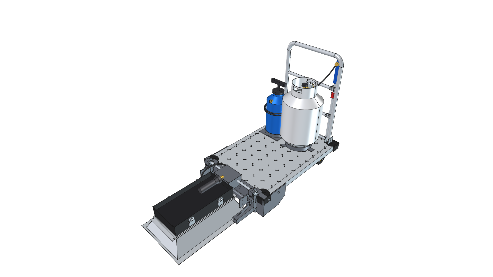
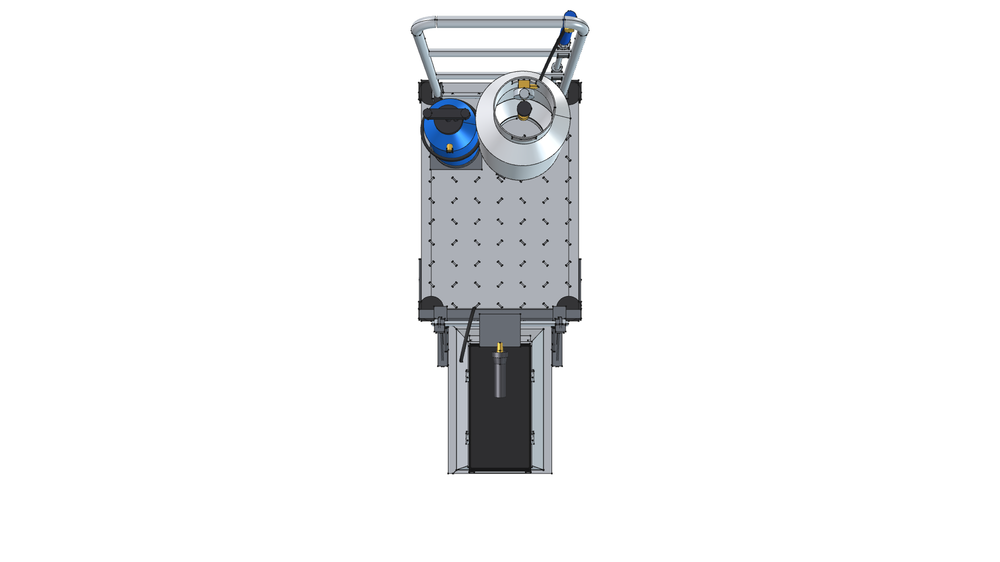
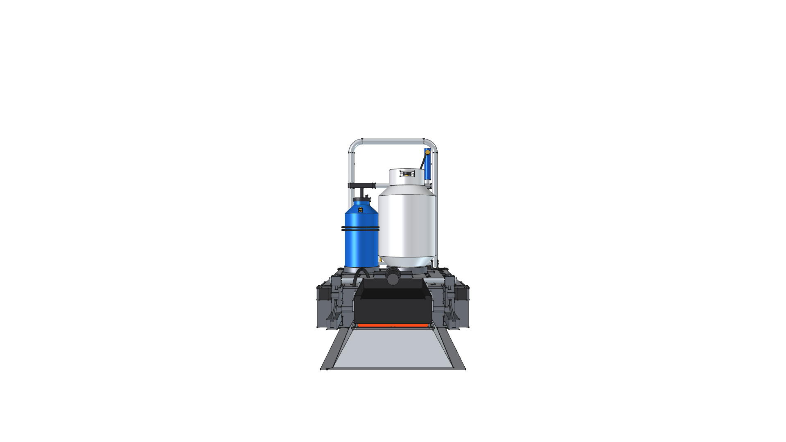
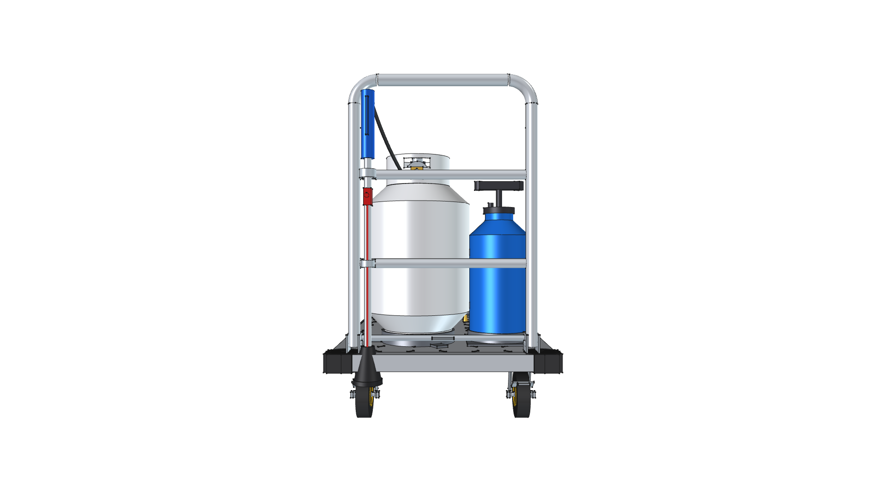
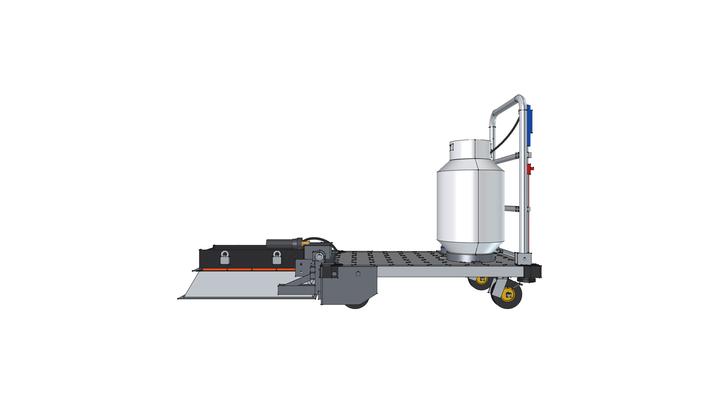
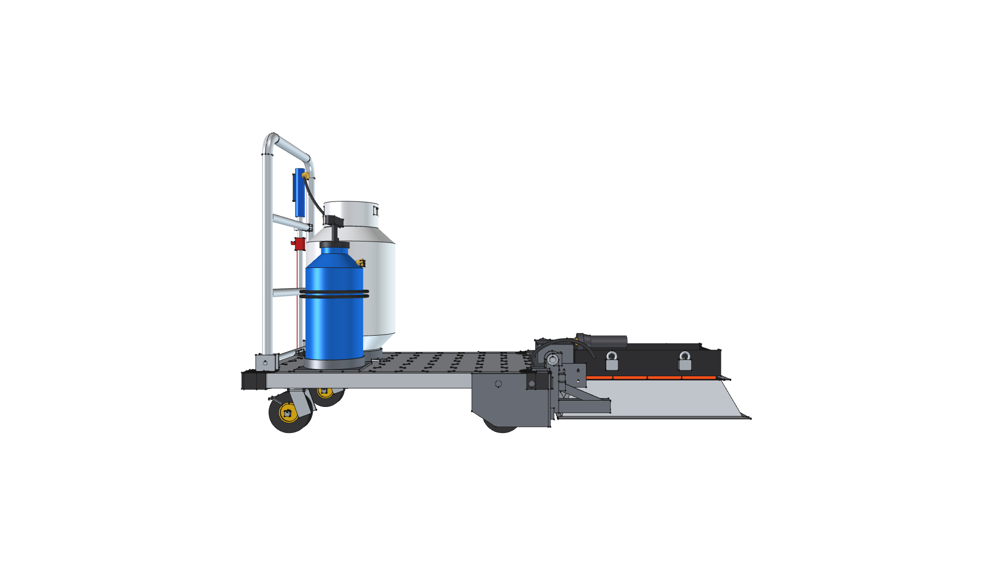
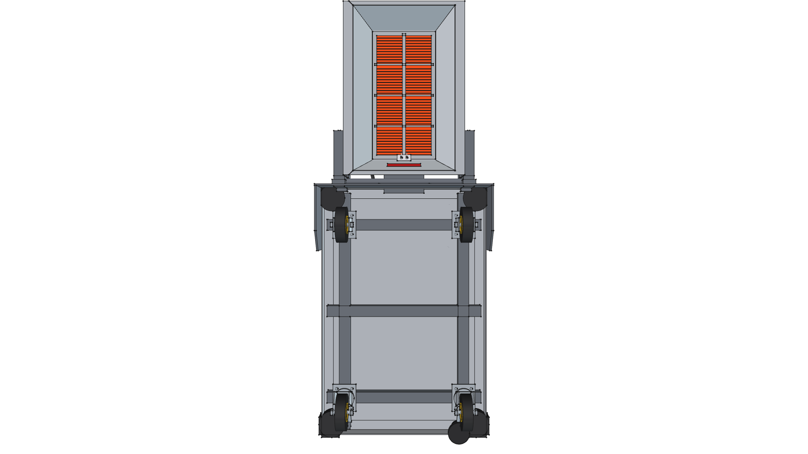

# Road Roaster 4W

> **4-Wheel Commercial Platform Dolly Architecture for Directional Ceramic Infrared Weed Eradication**  
> *Chemical-Free, Energy-Efficient Hardscape Weed Eradication via Cantilevered Radiant Heat*

**Active CAD Model**: [`road-roaster-4w.FCStd`](road-roaster-4w.FCStd)  
**Status**: 🟢 **`[RELEASED - v0.2.0]`**  
**Engineering Documents**: [**`BOM.md`**](BOM.md) | [**`SPECIFICATION.md`**](SPECIFICATION.md) | [**`CHANGELOG.md`**](CHANGELOG.md) | [**`HEAT_SOURCE_ANALYSIS.md`**](../HEAT_SOURCE_ANALYSIS.md) | [**`SOLARONICS_INQUIRY.md`**](../SOLARONICS_INQUIRY.md) | [**`WET_VS_DRY_STRATEGY.md`**](../WET_VS_DRY_STRATEGY.md)  
**Foundation**: Commercial 24" × 36" Heavy-Duty Platform Truck (5" Caster Running Gear, 29" Push Handle)  
**Parent Suite**: [**Road Roaster Platform**](../README.md)  
**Parallel Variant**: See [`road-roaster-2w`](../road-roaster-2w/) for the compact 2-wheel hand truck variant.



---

## 1. Architectural Vision: The 4-Wheel Dolly Evolution

While the compact [Road Roaster 2W](../road-roaster-2w/) leverages a 2-wheel vintage hand truck for tight garden paths and high slope agility, the **Road Roaster 4W** introduces a heavy-duty commercial platform cart foundation designed for large-scale driveway, roadway, and agricultural headland eradication:

```
┌────────────────────────────────────────────────────────────────────────────────────────┐
│                         ROAD ROASTER 4W SYSTEM ARCHITECTURE                            │
│                                                                                        │
│  [FRONT CANTILEVER BURNER]  ◄──  [24x36 PLATFORM DECK]  ──►  [REAR POWER & CONTROLS]   │
│   • 30,000 BTU Solaronics K-30    • Commercial 1,000+ lb      • Standard 20 lb LP Tank │
│     Ceramic Infrared Engine         Diamond Plate Deck          (430,960 BTU capacity) │
│   • Flared Mirror Reflector Hood  • Bolted Heavy-Gauge Front  • 29" Tubular Push Handle│
│     with 45° Miter Relief Corners   Skirt & Arched Brackets     with Dual Cross Rails  │
│   • 3/4" Continuous Pivot Axle    • 2.5 Gal Pressurized       • Auxiliary Spot Torch   │
│     with 180° Flip Transit Hinge    Water Safety Reservoir      (HF #91037) Wand in    │
│   • Triangulated Cantilever Truss • 4-Wheel Running Gear:       Quick-Draw Holster     │
│     and Cart-Side LP Manifold       2 Front Rigid, 2 Rear                              │
│   • 1.5" Ground Hover Lock          Swivel w/ Foot Brakes                              │
└────────────────────────────────────────────────────────────────────────────────────────┘
```

1. **Massive Energy & Water Payload**: A spacious 24" × 36" (610 mm × 914 mm) deck effortlessly accommodates a full **20 lb LP propane cylinder** (430,000 BTU capacity = ~14 hours runtime at 30k BTU/hr), auxiliary water reservoir, and safety gear without tipping risks.
2. **Cantilevered Front Solaronics K-30 Burner**: The realistic ceramic infrared radiant engine is suspended cantilevered out in front of the dolly deck, hovering stably 1.5" above the ground with lower flared reflector skirts maximizing heat soak efficiency.
3. **Bolted Front Skirt & 3/4" Continuous Pivot Axle**: A 3/16" formed steel apron bolted to the cart front lip carries dual arched ear brackets and a continuous 3/4" cold-rolled steel axle, providing extreme torsional stiffness.
4. **180° Flip Transit / Stowage Mechanism**: The cantilevered burner assembly pivots 180° over the axle onto the clear front deck space, shifting center of gravity rearward directly over the 4-wheel wheelbase ($X = +0.31''$, $Y = +0.53''$) for stable transport and compact garage storage.
5. **Cart-Side Protected LP Gas Supply**: Burner manifold and control enclosure face rearward towards the cart, connecting to a flexible reinforced LP supply loop without exposed dangling lines.
6. **Auxiliary Spot Wand Integration**: Dual horizontal cross-rails on the 29" tubular push handle provide quick-draw clip mounts for an auxiliary spot weed torch (`torch_hf91037`) to target fence lines, curbs, and tight obstacles.

---

## 2. Platform Comparison: Road Roaster 4W vs. Road Roaster Hand Truck

| Feature | Road Roaster Hand Truck (`road-roaster-2w`) | Road Roaster 4W (`road-roaster-4w`) |
| :--- | :--- | :--- |
| **Chassis** | Repurposed vintage 2-wheel hand truck | Commercial 24" × 36" 4-wheel platform cart |
| **Footprint** | 18" W × 20" L (ultra-compact) | 24" W × 36" L (spacious, stable) |
| **Wheel Setup** | Dual 9.5" pneumatic axle wheels | 4 Caster Wheels: 2 rigid front, 2 rear swivel w/ locks (5.0" dia) |
| **Fuel Capacity** | 1 lb Propane Bottle (~40 min runtime) | 20 lb Propane Tank (~14.4 hours runtime @ 30k BTU/hr) |
| **Burner Position** | Common-axis axle suspension sled | Cantilevered front mount with 180° flip-back stowage |
| **Handle Height** | 46.0" top of U-bend | 29.0" above deck (with dual cross rails) |
| **Auxiliary Torch** | None | Handle-mounted spot torch wand (`torch_hf91037`) |
| **Water / Safety** | Handheld bottle only | Dedicated on-deck 2.5 gal pressurized spray tank ([`water_tank`](../../../components/water_tank/)) |
| **Self-Propulsion** | Manual push / tilt | Future front-wheel slow crawl drive ready |
| **Target Use Case** | Narrow garden paths, steep stairs, tight gates | Driveways, roadways, paver patios, commercial headlands |

---

## 3. Visual Projection Gallery

| Home (Perspective) View | Top Plan View |
| :---: | :---: |
|  |  |
| **Front Elevation** | **Rear Elevation** |
|  |  |
| **Right Side Elevation** | **Left Side Elevation** |
|  |  |
| **Bottom Plan View** | |
|  | |

---

## 4. Visual Transformation & Version Evolution

| Version | Milestone Thumbnail | Date | Key Architectural Highlights |
| :--- | :---: | :---: | :--- |
| **v0.2.0** |  | *2026-09-07* | **Solaronics K-30 Integration, Bolted Front Skirt & Cantilever Pivot Axle**: Full integration of realistic Solaronics K-30 ceramic infrared radiant burner engine (173 sq. in radiating matrix) with flared reflector hood in protected cart-side orientation; 3/16" bolted front skirt apron; continuous 3/4" pivot axle with arched ear brackets; triangulated cantilever drop arms locking 1.5" ground hover; and 180° flip-back stowage mechanism onto front deck. |
| **v0.1.0** |  | *2026-09-04* | **Integrated 4-Wheel Dolly Architecture**: Full integration of commercial 24" × 36" cart foundation (5" wheels, 29" handle), rear 20 lb propane cylinder, handle-mounted spot torch wand, 2.5 gal water safety tank, and front cantilevered 180° flip-back burner assembly with height adjustment. |

---

## 5. Build & CAD Verification

To generate the active `.FCStd` model and 7 perspective views:
```bash
# Using repository runner:
./scripts/run_freecad.sh projects/road-roaster/road-roaster-4w/build.py

# Or directly with xvfb-run:
PYTHONPATH=src xvfb-run -a /home/phi/AppImages/FreeCAD_1.1.3-Linux-x86_64-py311.AppImage -c "__file__='projects/road-roaster/road-roaster-4w/build.py'; exec(open(__file__).read())"
```

