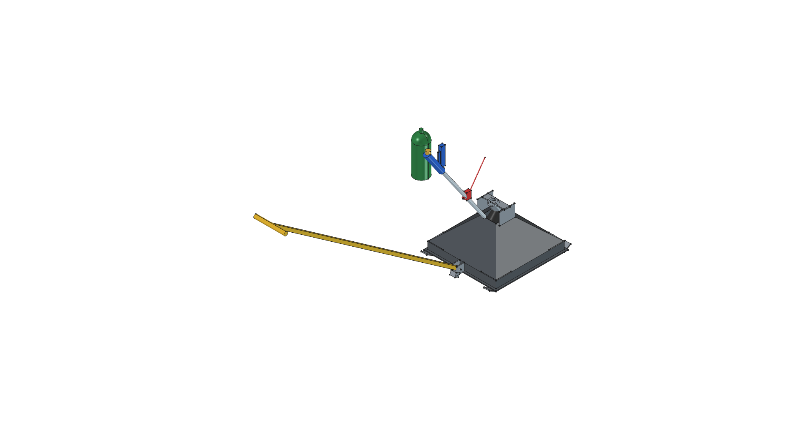
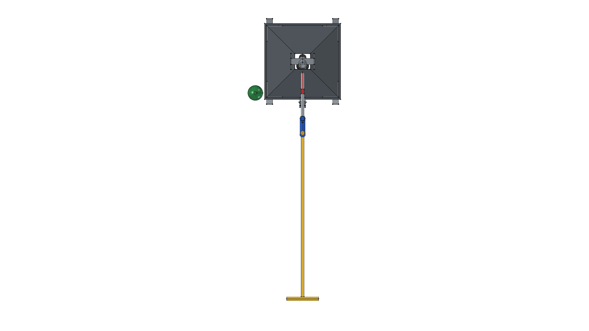
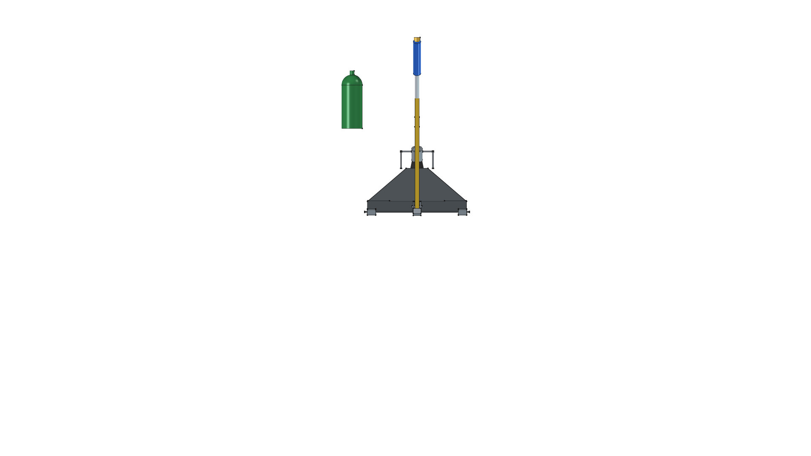
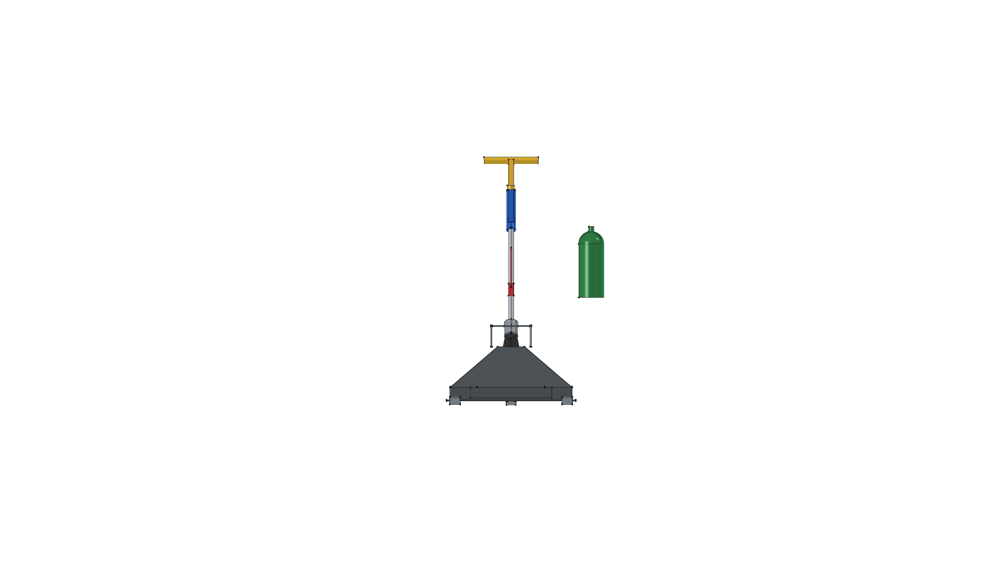
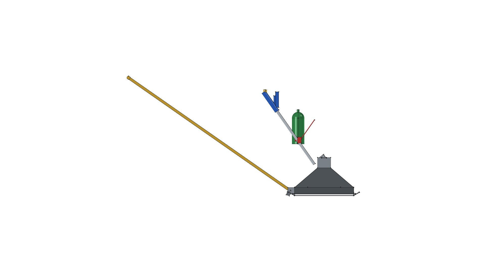
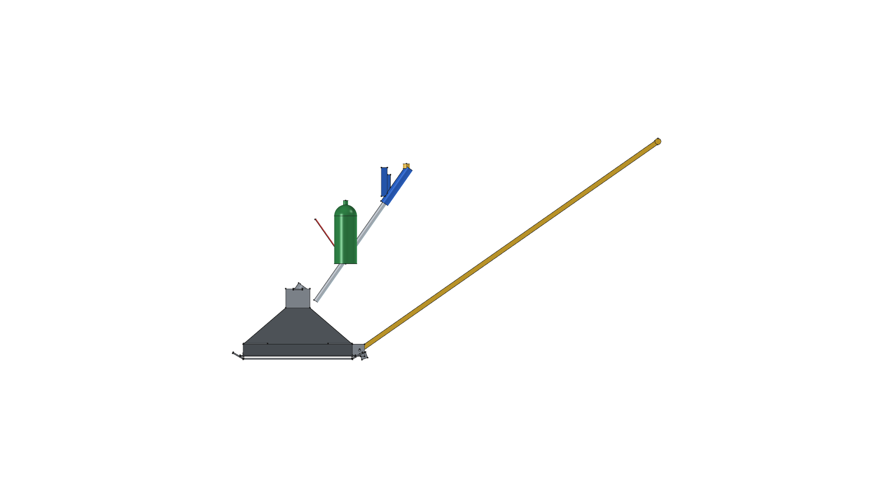
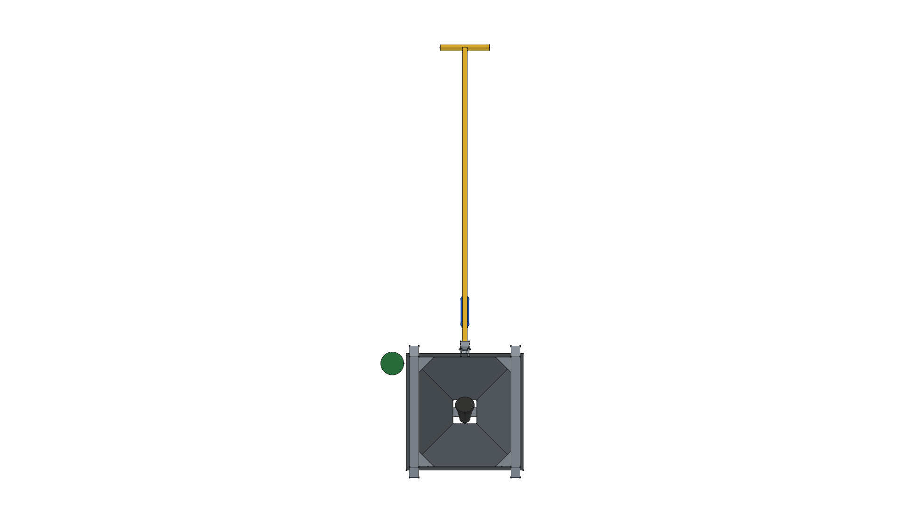

# Road Roaster — Version 1.3.0

> *Towable Thermal Weed Shock Sled*

**CAD Model**: [`sled_v04.FCStd`](sled_v04.FCStd)  
**Parent Project**: [Road Roaster Master Directory](../)  

---

## Version Overview

**Version 1.3.0** is an earlier release of the **Road Roaster** (Towable Flame Weeding Sled). It organizes the 3D parametric FreeCAD assembly into 4 modular `App::DocumentObjectGroup` containers (`Flame_Sled_Pyramid_Hood`, `Overhead_Support_Frame`, `Rigid_Towbar_Hitch`, `Harbor_Freight_Torch_91037`).

---

## 3D CAD Multi-View Projection Gallery (v1.3.0)

| Isometric (Home View) | Top Plan View |
| :---: | :---: |
|  |  |
| **Front Elevation** | **Rear Elevation** |
|  |  |
| **Right Side Elevation** | **Left Side Elevation** |
|  |  |
| **Bottom Plan View** | |
|  | |

---

## Version Documentation Index

- 📋 [**REQUIREMENTS.md**](REQUIREMENTS.md): Version 1.3.0 requirements, target operating speed, thermal constraints, and puller ergonomic safety.
- 📐 [**SPECIFICATION.md**](SPECIFICATION.md): Version 1.3.0 engineering specification, hood apex collar, torch angle, and hitch pin dimensions.
- ✂️ [**CUT_LIST.md**](CUT_LIST.md): Cut list for angle grinder prep, flat sheet metal panels, and angle iron frame rails.
- 🛠️ [**FABRICATION_GUIDE.md**](FABRICATION_GUIDE.md): Step-by-step welding, assembly, torch clamping, and operating guide.
- 📦 [**BOM.md**](BOM.md): Complete itemized Bill of Materials with hardware callouts.
- 🛠️ [**`build.py`**](build.py): FreeCAD Python parametric build generator script.

---

## FreeCAD Execution Command

```bash
/home/phi/AppImages/FreeCAD_1.1.3-Linux-x86_64-py311.AppImage -c "__file__='/home/phi/PROJECTS/phi-WORKS/maker/projects/road-roaster/v04/build.py'; exec(open(__file__).read())"
```
