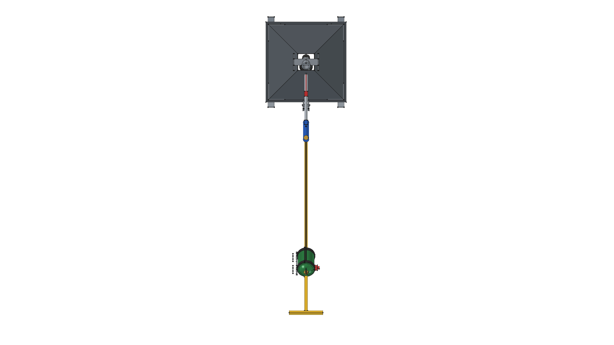
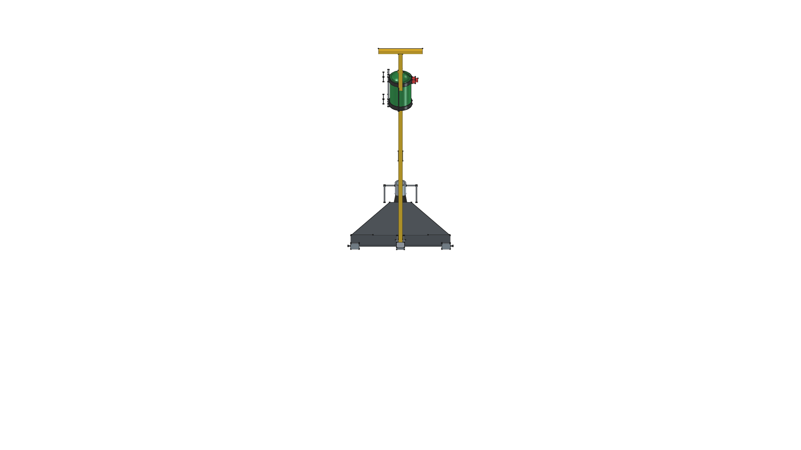
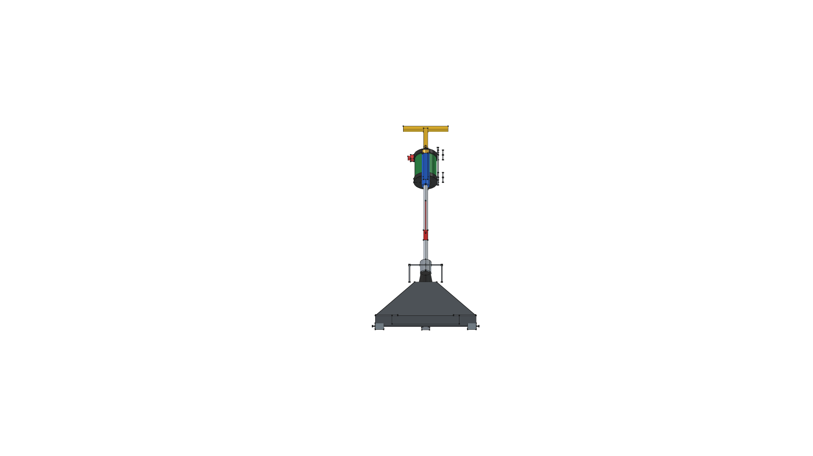
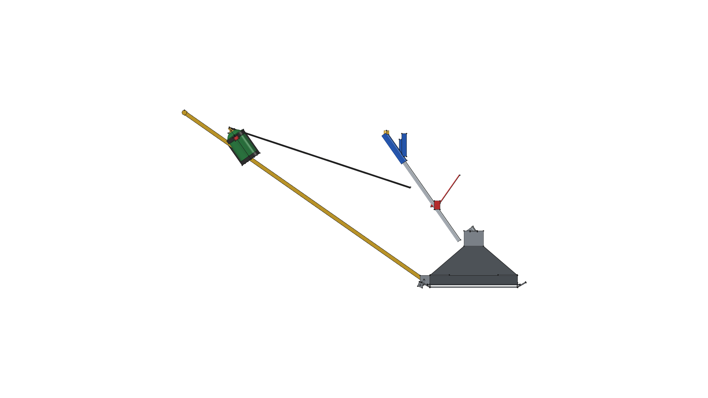
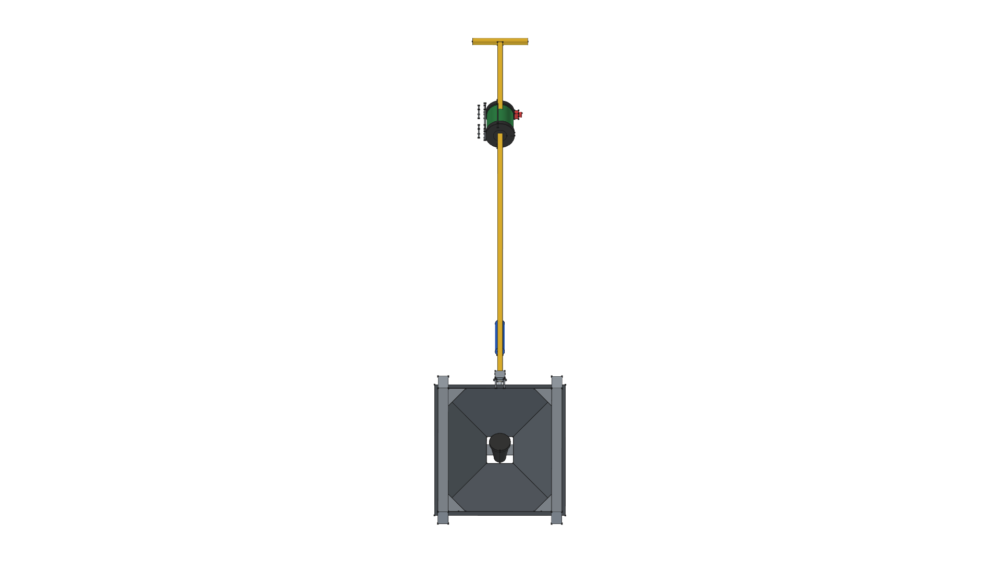
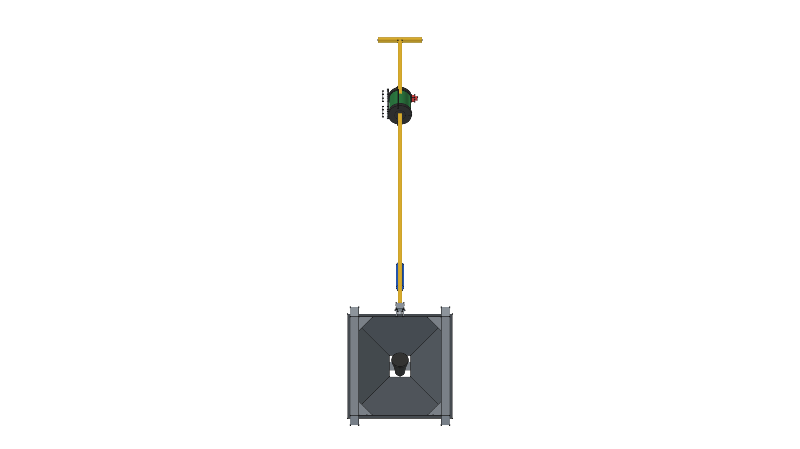

# Road Roaster — Version 1.4.0

> **Towable Thermal Weed Shock Sled**  
> *Onboard Propane Harness & Imported Component Integration*

---

## 1. Version 1.4.0 Overview

Version 1.4.0 introduces onboard fuel bottle mounting, quick-release harness integration, and build script function-level refactoring:
- **Standalone 1 lb Propane Cylinder Component (`components/propane_cylinder_1lb/`)**: Parametric CAD representation of standard 1 lb propane bottle ($D = 98.4\text{ mm}$, $H = 198\text{ mm}$, 1"-20 UNEF brass valve stem, and recessed bottom seat collar).
- **Propane Bottle Harness Component (`components/propane_harness/`)**: Bike-cage-style quick-slip harness with bottom seat cup, side retention arms, quick-latch strap, and dual 3/4" square-tube mounting clamps.
- **Tow Bar Mounting**: Clamps harness to upper tow bar ($Z \approx 750\text{--}850\text{ mm}$), placing bottle within easy reach of operator and routing high-pressure hose directly to torch wand flow valve knob.
- **Functional Build Script Architecture**: Decomposes `v1.4.0/build.py` into modular subassembly builder functions (`build_hood_subassembly`, `build_overhead_frame_subassembly`, `build_torch_subassembly`, `build_propane_harness_subassembly`, `build_tow_rigging_subassembly`).

**CAD Model**: [`sled_v1.4.0.FCStd`](sled_v1.4.0.FCStd)

|  |  |
| :---: | :---: |
|  |  |
|  |  |
|  | |

---

## 2. Documentation Index

- 📋 [**REQUIREMENTS.md**](REQUIREMENTS.md) — Requirement delta matrix from v1.3.0 master baseline.
- 📐 [**SPECIFICATION.md**](SPECIFICATION.md) — Technical parameters, parameters table, and subassembly tree.
- ✂️ [**CUT_LIST.md**](CUT_LIST.md) — Raw stock cut sizes, tube dimensions, and sheet metal cut list.
- 🛠️ [**FABRICATION_GUIDE.md**](FABRICATION_GUIDE.md) — Fabrication, welding, harness mounting, and gas line setup steps.
- 📦 [**BOM.md**](BOM.md) — Complete Bill of Materials, commercial tools, and hardware fasteners.

---

## 3. FreeCAD Build Command

To generate the active master model (Version 1.4.0) and export all 7 orthographic/isometric PNG snapshot renders:

```bash
/home/phi/AppImages/FreeCAD_1.1.3-Linux-x86_64-py311.AppImage -c "__file__='/home/phi/PROJECTS/phi-WORKS/maker/projects/road-roaster/v1.4.0/build.py'; exec(open(__file__).read())"
```
